# ธนาคาร (Thanakan) v2


[](https://pypi.org/project/thanakan/)
[](https://pypi.org/project/thanakan/#attestations)
[](https://ninyawee.github.io/thanakan)

**เครื่องมือจัดการธนาคารไทยครบวงจร** — Thai Bank Utilities

**[Documentation](https://ninyawee.github.io/thanakan)** | **[GitHub](https://github.com/ninyawee/thanakan)**

---

## ✨ ใหม่: End-to-End Statement Reconciliation

**ดาวน์โหลด Statement จาก Email → แปลงเป็น Excel → นำเข้า Peak บัญชี ในคำสั่งเดียว!**

```mermaid
flowchart LR
    A["📧 Gmail<br/>อีเมล Statement"] --> B["📄 PDF<br/>ดาวน์โหลดอัตโนมัติ"]
    B --> C["🔍 Parse<br/>อ่าน & รวมข้อมูล"]
    C --> D["📊 Excel<br/>Peak Format"]
    D --> E["✅ Peak<br/>นำเข้าบัญชี"]
```



```bash
# ดาวน์โหลดจาก Gmail และส่งออกเป็น Peak format (3 เดือนล่าสุด)
thanakan accounting peak output.xlsx --since 3m

# หรือใช้ไฟล์ PDF ที่มีอยู่แล้ว
thanakan accounting peak output.xlsx ./statements/
```

**ฟีเจอร์ครบถ้วน:**
- ✅ ดาวน์โหลด Statement อัตโนมัติจาก Gmail (KBank, BBL, SCB)
- ✅ รองรับ PDF ที่มีรหัสผ่าน
- ✅ รวมหลาย Statement เป็นบัญชีเดียว (deduplicate)
- ✅ ตรวจสอบความต่อเนื่องของยอดเงิน
- ✅ ส่งออก Peak Import Statement format

---

## แพ็คเกจ (Packages)

ติดตั้งเฉพาะที่ต้องการ หรือติดตั้งทั้งหมดด้วย `thanakan`

| แพ็คเกจ | คำอธิบาย | Install |
|---------|----------|---------|
| `thanakan-qr` | อ่าน QR จากสลิปโอนเงิน | `pip install thanakan-qr` |
| `thanakan-oauth` | เชื่อมต่อ API ธนาคาร (SCB, KBank) | `pip install thanakan-oauth` |
| `thanakan-statement` | อ่าน PDF Statement | `pip install thanakan-statement` |
| `thanakan-mail` | ดาวน์โหลด Statement จาก Gmail | `pip install thanakan-mail` |
| `thanakan-accounting` | ส่งออกไป Peak บัญชี | `pip install thanakan-accounting` |

---

## การติดตั้ง (Installation)

```bash
# ติดตั้งทุกแพ็คเกจ
pip install thanakan
# หรือ
uv add thanakan
```

### ติดตั้งแบบ Global

```bash
uv tool install thanakan
# หรือ
pipx install thanakan
```

### รันโดยไม่ต้องติดตั้ง (uvx)

```bash
uvx thanakan qr slip.png
uvx thanakan statement parse statement.pdf
```

### System Dependencies

การอ่าน QR ต้องติดตั้ง libzbar:

```bash
# Ubuntu/Debian
sudo apt-get install libzbar0

# macOS
brew install zbar
```

---

## การใช้งาน (Usage)

### อ่าน QR จากสลิป

```bash
# จากไฟล์รูป
thanakan qr slip.png

# จาก clipboard (macOS)
pbpaste | thanakan qr

# Pipe กับ jq
thanakan qr slip.png | jq .payload
```

### อ่าน Statement PDF

```bash
# อ่านไฟล์เดียว
thanakan statement parse statement.pdf

# อ่านทั้ง directory
thanakan statement parse ./statements/

# ส่งออกเป็น Excel
thanakan statement export ./statements/ output.xlsx --format excel
```

### ดาวน์โหลดจาก Gmail

```bash
# Authenticate ครั้งแรก
thanakan mail auth

# ดาวน์โหลด Statement (30 วันล่าสุด)
thanakan mail download kbank
thanakan mail download bbl --output ./statements
thanakan mail download all --since 3m
```

### ส่งออกไป Peak

```bash
# ดาวน์โหลดจาก Gmail + ส่งออก Peak
thanakan accounting peak output.xlsx

# จากไฟล์ PDF ที่มีอยู่
thanakan accounting peak output.xlsx ./statements/

# เลือกช่วงเวลา
thanakan accounting peak output.xlsx --since 3m --until 1m
```

---

## Python API

```python
# ใช้ main package
from thanakan import SlipQRData, SCBAPI, KBankAPI

# หรือ import โดยตรง
from thanakan_qr import SlipQRData
from thanakan_oauth import SCBAPI, KBankAPI
from thanakan_statement import parse_pdf, consolidate_by_account
```

### อ่าน QR

```python
from PIL import Image
from thanakan import SlipQRData

image = Image.open("slip.png")
data = SlipQRData.create_from_image(image)
print(data.payload.sending_bank_id)
print(data.payload.transaction_ref_id)
```

### อ่าน Statement

```python
from thanakan_statement import parse_all_pdfs, consolidate_by_account

statements = parse_all_pdfs("./statements/")
accounts = consolidate_by_account(statements, preferred_language="en")

for account in accounts:
    print(f"{account.account_number}: {len(account.all_transactions)} รายการ")
```

---

## ธนาคารที่รองรับ (Supported Banks)

| ธนาคาร | QR | Statement | OAuth API | Gmail |
|--------|:--:|:---------:|:---------:|:-----:|
| KBank (กสิกร) | ✅ | ✅ | ✅ | ✅ |
| SCB (ไทยพาณิชย์) | ✅ | ✅ | ✅ | ✅ |
| BBL (กรุงเทพ) | ✅ | ✅ | — | ✅ |
| KTB (กรุงไทย) | ✅ | — | — | — |
| TTB (ทหารไทยธนชาต) | ✅ | — | — | — |
| BAY (กรุงศรี) | ✅ | — | — | — |

---

## ☕ สนับสนุน (Support)

หากโปรเจคนี้มีประโยชน์ สามารถสนับสนุนได้ที่:

[](https://ko-fi.com/ninyawee)

## 📄 License

MIT
